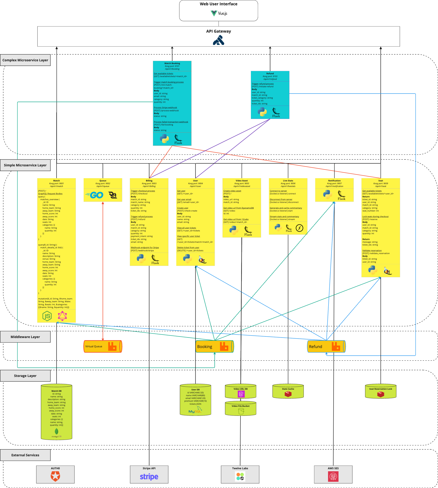
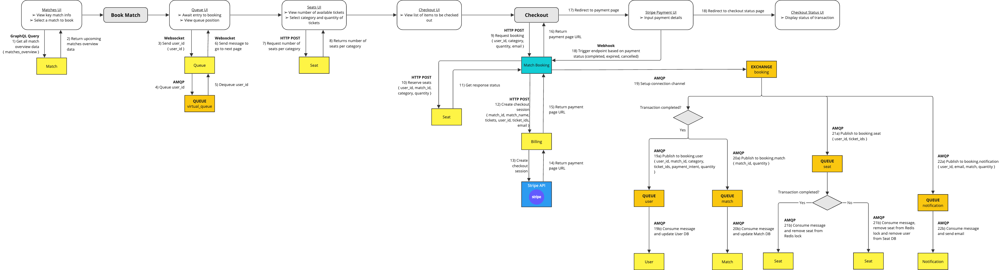
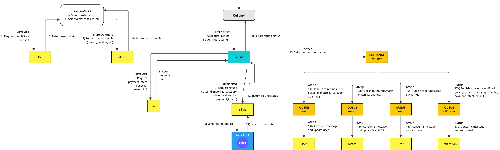
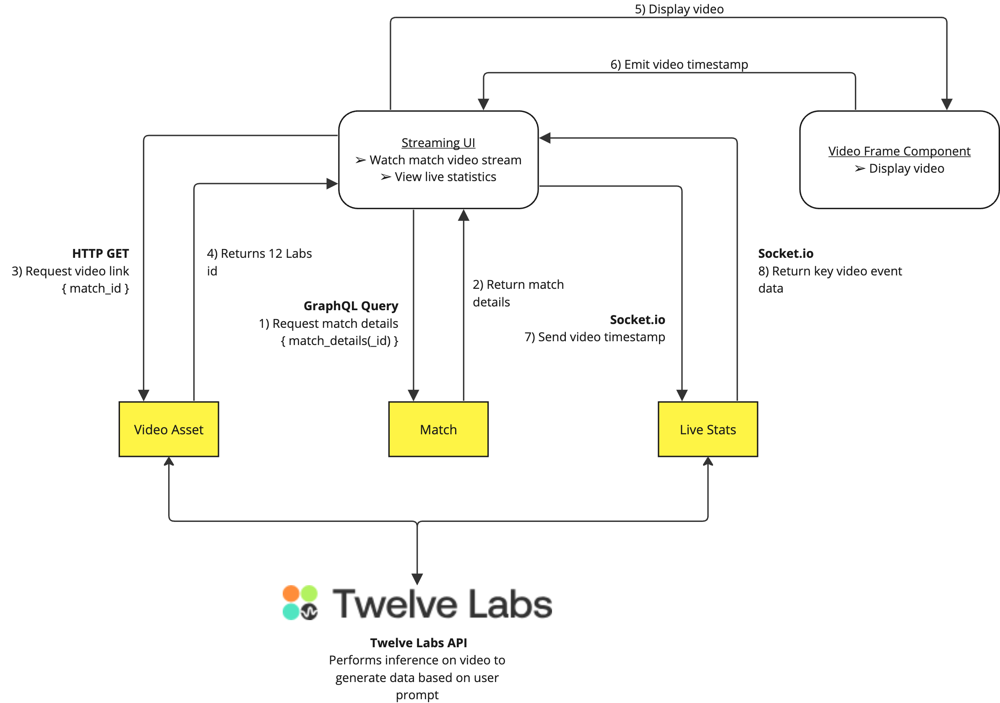

```
━┏┓━━━━━━━┏┓━━━━━━━┏┓━┏┓━━━━━━━━━━━━━━━┏┓━
┏┛┗┓━━━━━━┃┃━━━━━━┏┛┗┓┃┃━━━━━━━━━━━━━━┏┛┗┓
┗┓┏┛┏┓┏━━┓┃┃┏┓┏━━┓┗┓┏┛┃┗━┓┏━━┓┏━━┓┏━━┓┗┓┏┛
━┃┃━┣┫┃┏━┛┃┗┛┛┃┏┓┃━┃┃━┃┏┓┃┃┏┓┃┃┏┓┃┃━━┫━┃┃━
━┃┗┓┃┃┃┗━┓┃┏┓┓┃┃━┫━┃┗┓┃┗┛┃┃┗┛┃┃┗┛┃┣━━┃━┃┗┓
━┗━┛┗┛┗━━┛┗┛┗┛┗━━┛━┗━┛┗━━┛┗━━┛┗━━┛┗━━┛━┗━┛
━━━━━━━━━━━━━━━━━━━━━━━━━━━━━━━━━━━━━━━━━━
━━━━━━━━━━━━━━━━━━━━━━━━━━━━━━━━━━━━━━━━━━
```


## Technical Overview Diagram


## Workflow Diagrams
### Scenario 1


### Scenario 2


### Scenario 3


## Quickstart
To set up this repository, run the following command in the current working directory:
brian was here
```bash
docker-compose up
```

If you encounter issues, please use `docker compose down -v` to delete all volumes and existing containers. Then try the same command above.


## Microservices
### Base Microservices Ports:
- 1 Match CRUD Service: 9001
- 2 Queue Management Service: 9002
- 3 Billing (Stripe) Service: 9003
- 4 User Profile Service: 9004
- 5 Video Asset Handling Service: 9005
- 6 Live Match Service: 9006
- 7 Notification: 9007
- 8 Logging: 9008
- 9 Seat: 9009
### Orchestrators Ports:
- Match Booking Orchestrator: 9101
- Match Streaming Orchestrator: 9102
- Refund Orchestrator: 9103


## Others
### Setting up hot reload
This allows the changes you make in your local code to be immediately reflected in the containerized app. Add the following flag to your `docker run` command.<br><br>
`-v <path-to-directory-with-code>:/app`<br><br>
(replace the path with `$(pwd)` for Mac/Linux or `${PWD}` for Windows if your current directory contains the code)

### Docker Compose from a different file
Should you not want to test end-to-end docker compose, you can use docker-compose-test.yml, or a different name file.. use `docker compose --file docker-compose-test.yml up --build` to run this, and similarly, `docker compose down` to clean it up.

### Docker Compose with an .env file
`docker-compose --env-file .env up --build -d` - to build with .env
