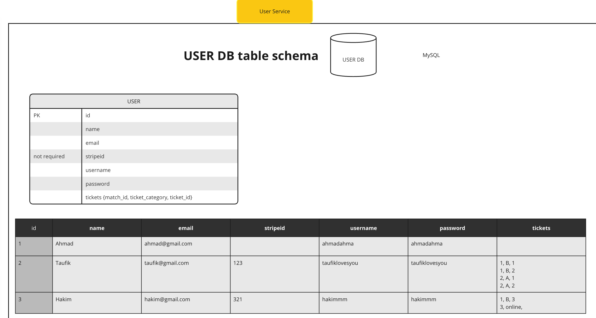

# User Profile Microservice
- main.py acts as the entry point for the user microservice.
- user_schemas is the pydantic models for the user_crud microservice and db.

The User Database will be in SQL and has 1 table:
- User Table

Note that the 'sub' field in Auth0 is the user's unique identifier and hence the primary key of the User Table.

Sample User:
```
{
    "id": 1,
    "name": "John Doe",
    "email": "john@example.com"
    "tickets": [
        {"match_id": 123, "ticket_category": "A", "serial_no": "1", "payment_intent": "abc"},
        {"match_id": 456, "ticket_category": "A", "serial_no": "2", "payment_intent": "cbd"},
    ],
    "premium": "Y",
}
```
note that stripe_id is optional and is only present if the user has bought a ticket.




If you get this error in mysql:
`--initialize specified but the data directory has files in it. Aborting...`
Delete the `dbdata` folder and compose up again.

## To implement
- [ ] Track the logged in user
- [ ] Code to create a new user
- [ ] Link code to create a new user using sub in Auth0
- [ ] If user is not registered, create a new user
- [ ] RabbitMQ is not working
- [ ] Create a lot of payment intents and put into the user database. 

## Issues
- [ ] If your user gets JSON format error, use docker compose up --force-recreate mysql

------
